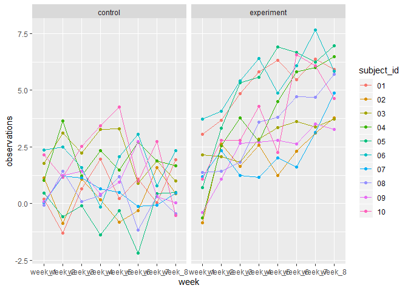
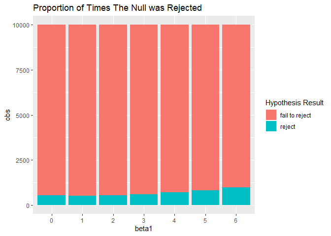
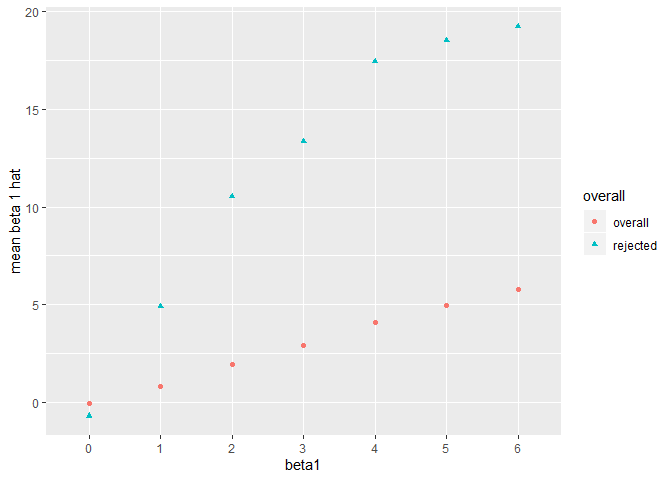

p8105\_hw5\_sl4269
================
Steven Lawrence
November 4, 2019

``` r
library(tidyverse)
```

    ## -- Attaching packages ------------------------------------------------------------- tidyverse 1.2.1 --

    ## v ggplot2 3.2.1     v purrr   0.3.2
    ## v tibble  2.1.3     v dplyr   0.8.3
    ## v tidyr   1.0.0     v stringr 1.4.0
    ## v readr   1.3.1     v forcats 0.4.0

    ## -- Conflicts ---------------------------------------------------------------- tidyverse_conflicts() --
    ## x dplyr::filter() masks stats::filter()
    ## x dplyr::lag()    masks stats::lag()

``` r
set.seed(10)

iris_with_missing = iris %>% 
  map_df(~replace(.x, sample(1:150, 20), NA)) %>%
  mutate(Species = as.character(Species))
```

Problem 1
=========

``` r
rep_miss<- function(x){
  
  if(is.numeric(x)){
    x[is.na(x)] = mean(x,na.rm = T)
  
  } else if (is.character(x)){
   x[is.na(x)] = "virginica"
  } else {
    stop("should be numeric or character")
  }
  
  x
  
}
```

``` r
iris_with_missing %>% map_dfr(rep_miss)
```

    ## # A tibble: 150 x 5
    ##    Sepal.Length Sepal.Width Petal.Length Petal.Width Species
    ##           <dbl>       <dbl>        <dbl>       <dbl> <chr>  
    ##  1         5.1          3.5         1.4         0.2  setosa 
    ##  2         4.9          3           1.4         0.2  setosa 
    ##  3         4.7          3.2         1.3         0.2  setosa 
    ##  4         4.6          3.1         1.5         1.19 setosa 
    ##  5         5            3.6         1.4         0.2  setosa 
    ##  6         5.4          3.9         1.7         0.4  setosa 
    ##  7         5.82         3.4         1.4         0.3  setosa 
    ##  8         5            3.4         1.5         0.2  setosa 
    ##  9         4.4          2.9         1.4         0.2  setosa 
    ## 10         4.9          3.1         3.77        0.1  setosa 
    ## # ... with 140 more rows

Problem 2
=========

Ploting a spagetti plot of the data
-----------------------------------

In this plot we see the control of stay relatived the same over the 8 week study period while we see a change in the experimental arm over the samte time period.

``` r
files_names<- paste("./data/",list.files("./data/"),sep="")

files_names<-list.files("./data/")


files_data = tibble(names = files_names) %>% 
  mutate(contents = map(names, ~read_csv(file.path("data/", .)))) %>% 
  unnest() %>% 
  separate(names,into = c("arm","subject_id")) %>%
  mutate(arm = recode(arm,
        "con" ="control",
        "exp" ="experiment"
  )
         ) %>% 
  pivot_longer(
    week_1:week_8,
    names_to = "week",
    values_to = "observations"
  ) 
```

    ## Warning: `cols` is now required.
    ## Please use `cols = c(contents)`

    ## Warning: Expected 2 pieces. Additional pieces discarded in 20 rows [1, 2,
    ## 3, 4, 5, 6, 7, 8, 9, 10, 11, 12, 13, 14, 15, 16, 17, 18, 19, 20].

``` r
files_data %>% ggplot(aes(x = week, y = observations, group = subject_id, col = subject_id))+geom_point() +
  facet_grid(~arm)+geom_line()
```



Problem 3
=========

``` r
sim_fun <- function(n = 30, beta1 , beta0 = 2,sig2 = 50){

  x = rnorm(n ,0,1)
  e = rnorm(n, 0, sig2)
  y = beta0 + beta1*x + e
  
  linreg<-lm(y ~ x)

  return(tibble(
  b1h = linreg$coefficients[2],
  pval= summary(linreg)$coefficients[8],
  beta1 = beta1
  ))
  
}

trials <- function(x, func, beta1 ){

1:x %>% map(function(x) func(beta1 = beta1)) %>% map_dfr(rbind) 
  
}


Beat1_data<-0:6 %>% 
  map(function(x) trials(10000, sim_fun, x)) %>% 
  map_dfr(rbind)
```

Proportion of hpothesis test results.
-------------------------------------

In this proportion bar plot we see that as the beta1or the coefficient of the x value increase there is an increase in rejecting the null. This means that as beta 1 increases the power of this test increases. Therefore for small sample sizes there needs to be a strong beta 1 effect on x in order to attain enough power.

``` r
   Beat1_data %>%  mutate(beta1 = as.numeric(beta1),
           beta1 = as.factor(beta1),
           null_rejected = case_when(
             pval < 0.05 ~ "reject",
             pval >= 0.05 ~ "fail to reject"
           )) %>% 
    group_by(beta1, null_rejected) %>% 
    summarize(
      obs = n()
    ) %>% 
  ggplot(aes(x = beta1, y =obs))+ 
   geom_bar( aes(#color = null_rejected, 
                 fill = factor(null_rejected)
                 ),
    stat = "identity", position = position_stack()
    )+
  scale_fill_discrete("Hypothesis Result")+
  ggtitle("Proportion of Times The Null was Rejected")
```



Scatter plot of mean beta 1 hat
-------------------------------

In this scatter plot we see that the mean of beta 1 hat drastically changes with repect to the increasing value of the true beta 1. Specifically for the rejected test results, beta 1 hat grew vastly due to the fact that the relationship of beta one and rejectis is the the higher the slope more likely a difference effect of x can be concluded.

``` r
overall <- Beat1_data %>%  mutate(beta1 = as.numeric(beta1),
           beta1 = as.factor(beta1),
           null_rejected = case_when(
             pval < 0.05 ~ "reject",
             pval >= 0.05 ~ "fail to reject"
           )
           ) %>% 
    group_by(beta1) %>% 
    summarize(
      mean_beta1 = mean(b1h)
    ) %>% 
  mutate(overall = "overall")

rejected <- Beat1_data %>%  mutate(beta1 = as.numeric(beta1),
           beta1 = as.factor(beta1),
           null_rejected = case_when(
             pval < 0.05 ~ "reject",
             pval >= 0.05 ~ "fail to reject"
           )
           ) %>% 
  filter(pval < 0.05) %>% 
    group_by(beta1) %>%
    summarize(
      mean_beta1 = mean(b1h)
    ) %>% 
  mutate(overall = "rejected")


rbind(overall, rejected) %>% 
  ggplot(aes(x = beta1, y = mean_beta1, col = overall, shape = overall))+
  geom_point(stat = "identity")+
  labs(y = "mean beta 1 hat", legend = NULL)
```



``` r
  ggtitle("Overal Beta1 hat means by True Beta1 Value")
```

    ## $title
    ## [1] "Overal Beta1 hat means by True Beta1 Value"
    ## 
    ## attr(,"class")
    ## [1] "labels"
